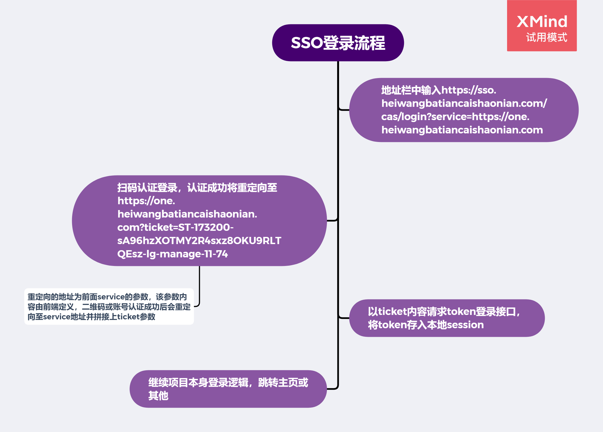

## 前端接入单点登录（sso）开发流程大礼包，内含vue、react、两种路由模式、微前端等sso单点登录流程

先简单说明一下，单点登录是什么，虽然写得是

以sso平台（sso.heiwangbatiancaishaonian.com）登录任意后台管理系统（one.heiwangbatiancaishaonian.com）为例说明sso单点登录的流程：



*sso提供的token过期时间为24小时，ticket的失效时间是5分钟，都不是永久有效的。*

如图可以看到，在登陆成功后的跳转中，参数是含有ticket的，举例中的one.heiwangbatiancaishaonian.com是history模式的，而在hash模式下url会表现为 https://one.heiwangbatiancaishaonian.com?ticket=ST-173200-sA96hzXOTMY2R4sxz8OKU9RLTQEsz-lg-manage-11-74#/ ，由于项目可能有url解析逻辑或者location判断逻辑，所以我们在处理登录时需要在完成登录后去除url中ticket字段，避免与项目本身冲突产生不必要的bug。

## 登录逻辑


*整体逻辑如图所示*

如图，以某一后台管理系统（one.heiwangbatiancaishaonian.com）分析测试用例，我们以结果为导向梳理一下这个逻辑

用户进入项目，有可能是两种情况：

1. sso登录后跳转的
   - 不带重定向参数
   - 带重定向参数（可选）
2. 直接输入想看的页面url
   - 首次登录（无token）
   - 二次登录（有token但不知是否失效）

url有三种情况：

1. https://one.heiwangbatiancaishaonian.com/login

   - localSession中有正确且有效的token

     正确结果：继续项目本身登录逻辑，通常为跳转至项目首页

   - localSession中有不正确或失效的token

     正确结果：重定向页面至https://sso.heiwangbatiancaishaonian.com/cas/login?service=https://one.heiwangbatiancaishaonian.com/login ，让用户重新登录

   - localSession中没有token（首次登录）

     正确结果：重定向页面至https://sso.heiwangbatiancaishaonian.com/cas/login?service=https://one.heiwangbatiancaishaonian.com/login ，让用户重新登录

2. https://one.heiwangbatiancaishaonian.com/appManage

   - localSession中有正确且有效的token

     正确结果：正常浏览网页

   - localSession中有不正确或失效的token

     正确结果：在携带token请求服务之后跳转至https://sso.heiwangbatiancaishaonian.com/cas/login?service=https://one.heiwangbatiancaishaonian.com/appManage，让用户重新登录

     *或：在携带token请求服务之后跳转至https://one.heiwangbatiancaishaonian.com/login?redirect=https://https://one.heiwangbatiancaishaonian.com/otherPage/appManage，让用户重新登录（可选）*

   - localSession中没有token（首次登录）

     **正确结果：直接重定向页面至https://sso.heiwangbatiancaishaonian.com/cas/login?service=https://one.heiwangbatiancaishaonian.com/appManage ，让用户登录**

     *或：直接重定向页面至https://one.heiwangbatiancaishaonian.com/login?redirect=https://https://one.heiwangbatiancaishaonian.com/otherPage/appManage，让用户重新登录（可选）*

3. https://one.heiwangbatiancaishaonian.com/login?redirect=https://https://one.heiwangbatiancaishaonian.com/otherPage/appManage（可选）

   - localsession中有正确且有效的token

     **正确结果：重定向页面至https://https://one.heiwangbatiancaishaonian.com/otherPage/appManage**

   - localsession中有不正确或失效的token

     正确结果：在携带token请求服务之后跳转至https://one.heiwangbatiancaishaonian.com/login?redirect=https://https://one.heiwangbatiancaishaonian.com/otherPage/appManage，让用户重新登录

   - localsession中没有token（首次登录）

     **正确结果：直接重定向页面至https://sso.heiwangbatiancaishaonian.com/cas/login?service=https://one.heiwangbatiancaishaonian.com/appManage ，让用户登录**

*三个测试用例分别对应为为登录逻辑组件，普通组件，url中带重定向参数的登录组件

> 注：注明可选的可以忽略，仅为需要记住用户当前url时使用，部分项目不适用于这种方式，公司后台中部分项目本身有登录后重定向逻辑，因权限问题，不适用于直接跳转回当前url，应在判断完登录状态之后交由原项目处理，新项目可以添加这种逻辑。

## 例子

由于权限问题，前端须保证用户首次访问（既没有token）的时候，尽量不看到页面，因此我们须在渲染页面之前有一层判断。

另外，还要根据网络请求后返回的code判断token是否过期，例子中分别是react跟vue的写法。

### react - 跳转时参数会带上当前url

#### HOC验证是否有token

```javascript
  {
    path: '/',
    component: '@/layouts/SecurityLayout',
    routes: [
      {
        path: '/',
        component: '@/layouts/BasicLayout',
        routes: [
          {
            path: '/',
            redirect: '/appManage',
          },
          {
            path: '/appManage',
            name: 'appManage',
            component: './appList',
          },
          ...
  }
```

*.config\routes.ts*

```javascript
  render() {
    const { isReady } = this.state;
    const { children, loading } = this.props;
    const jwt = getToken();
    const isLogin = jwt && jwt.expireAt && jwt.expireAt > moment().unix();

    if ((!isLogin && loading) || !isReady) {
      return <PageLoading />;
    }
    if (!isLogin && window.location.pathname !== '/user/login') {
    
	const DOMAIN = 'https://sso.heiwangbatiancaishaonian.com'
    const { redirect } = getPageQuery();
    const queryString = stringify({
      redirect: redirect || window.location.href,
    });
    const service = `${window.location.origin}/user/login?${queryString}`;
    window.location.href = `${DOMAIN}/cas/login?service=${service}`;
    	return null;
    }
    return children;
  }
```

*src\layouts\SecurityLayout.tsx*

在路由中添加多一级高阶组件SecurityLayout,如果通过验证才渲染路由中页面，否则跳转。

**注意HOC判断中必须先判断当前页是否为/login**

#### http拦截器

```javascript

request.interceptors.response.use(async (response: Response) => {
  const data = await response.clone().json();
    
  if (data.respCode >= 40100 && data.respCode < 40199) {
    localStorage.clear();
    const ssoURL = 'https://sso.heiwangbatiancaishaonian.com/cas/login'
    const { redirect } = getPageQuery();
    const queryString = stringify({
      redirect: redirect || window.location.href,
    });
    const service = `${window.location.origin}/user/login?${queryString}`;
    window.location.href = `${ssoURL}?service=${service}`;
    ...
```

*src\utils\request.ts*

返回拦截判断code，不成功就跳转，跳转时定义redirect字段以当前路径为参数拼入重定向链接

#### login组件

```javascript


const Login: React.FC<LoginProps> = props => {
  useEffect(() => {
    const { dispatch, location } = props;
    // node中querystring模块
    const queryString = stringify({
      redirect: location.query.redirect,
    });
    const service = `${window.location.origin}/user/login?${queryString}`;
    dispatch({
      type: 'login/login',
      payload: {
        ticket: location.query.ticket,
        service: service,
      },
    });
  }, []);

  return (
    <div className={styles.main}>
      <PageLoading />
    </div>
  );
};
```

*src\pages\user\login\index.tsx*

以当前路径拼接redirect为service的字段请求token。

**该例子中请求token的service参数有可能与sso的url参数中service值不同，这不是常规的操作，正确的请求参数必须与sso的url参数中service值一致，否则无法通过验证**

### vue - 不记录url

#### beforeEach验证是否有token

```javascript

import VueRouter from 'vue-router'

// 路由相关
VueRouter.beforeEach((to, from, next) => {
  const ua = window.navigator.userAgent.toLowerCase()
  if (!ua.includes('wxwork') && to.name !== ('index') && to.name !== ('login') && !localStorage.getItem('token')) {
    const ssoURL = 'https://sso.heiwangbatiancaishaonian.com/cas/login'
    const service = location.search ? location.href.split(location.search)[0] : location.href
    window.location.href = `${ssoURL}?service=${service}`
  }
  next()
})
```

*src\main.js*

如果通过验证才渲染路由中页面，否则跳转，本质上跟HOC差不多。

**注意判断中必须先判断当前页是否为login或index(该项目中index会重定向至login)**

#### login组件

```javascript

    async login () {
      let code
      let res
      if (this.getUrlParams('code') || this.$route.query.code) {
        code = this.getUrlParams('code') || this.$route.query.code
        res = await this.$axios.post(this.$api.login, {
          code: code
        })
      } else if (this.getUrlParams('ticket') || this.$route.query.ticket) {
        const ticket = this.getUrlParams('ticket')
        res = await this.$axios.post(this.$api.loginCas, {
          ticket: ticket,
          service: `${location.href.split(location.search)[0]}`
        })
      } else {
        Message({
          type: 'error',
          message: '登录缺少必要参数，请重试'
        })
        return
      }
      ...
      //原有登录逻辑
   }
```

根据不同浏览器请求不同接口，共用res不影响原有登录逻辑。

#### http请求拦截器

```javascript
axios.interceptors.response.use(
  response => {
		...
        // 错误码为6说明未登录或token失效
        case 6: {
          localStorage.removeItem('token')
          const ua = window.navigator.userAgent.toLowerCase()
          if (!ua.includes('wxwork')) {
            const ssoURL = 'https://sso.heiwangbatiancaishaonian.com/cas/login'
            const service = location.search ? location.href.split(location.search)[0] : location.href
            window.location.href = `${ssoURL}?service=${service}`
          } else {
            router.replace({
              path: '/login',
              query: { id: router.currentRoute.query.id }// 登录成功后跳入浏览的当前页面
            })
          }
          return response.data
        }
        ...
        }
)        
```

根据后端返回code判断token是否过期，所有页面token过期都返回同一个地址

**注意：vue项目中大多采用hash模式的路由，地址中会有#，如果有ticket或其他search，地址会变成xxx/ticket=xxxx#/xxx，所以需要加一层判断`const service = location.search ? location.href.split(location.search)[0] : location.href`。如果在登录后重定向去除了url中的ticket，则不需要加这个判断**

### 微前端

最近这个好像在征文，我说说缺点吧。

妈的这个是真的坑，当然也可能是我真的菜，如有不对请指正。

- 开发环境下每个系统要单独写一个proxy，配置代理
- css样式没法完全隔离，qiankun通过类名哈希来隔离样式，但子应用遇到`position:fiexd`怎么办，全乱成一锅粥了。
- 子应用内的接口都是原来的，测试环境，预发布环境，正式环境域名都不一样，前端文件部署到服务器后，后端的接口也会跨域，那后端也要配无数跨域。
- 我司的后台管理系统基本都有部署在企业微信应用里的，那ua得判断三种，企业微信，微前端环境，web环境，有些系统有本身的登录逻辑，各种各样的写法都有，微前端有自己单独的生命周期，无法完全兼容，子应用也要爆改。
- 还有一些生命周期的我忘了，但反正最后基本放弃了。

总结一下，其实微前端的解决方案理论上应该是最契合单点登录的，但改起来有点太麻烦了，适合新项目，不适合旧项目，旧项目接入基本等于半个重构，想一键装载还是有点难。

